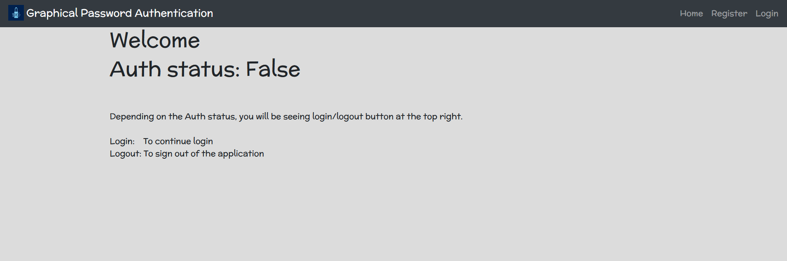
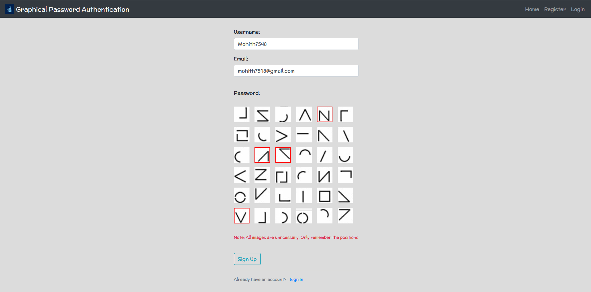
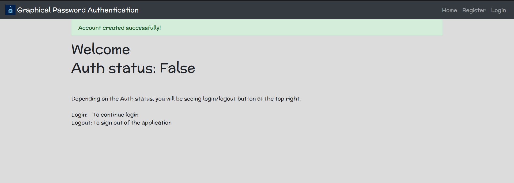
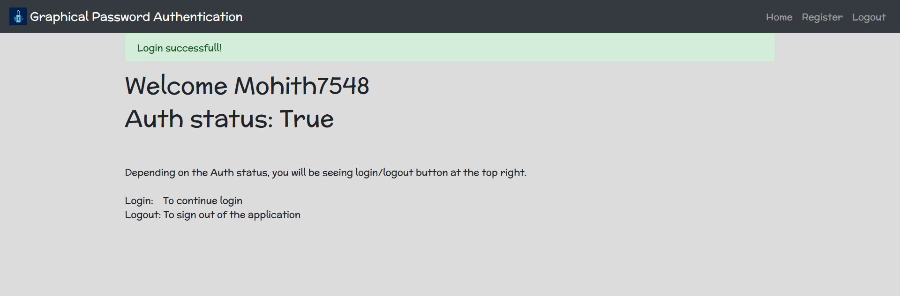
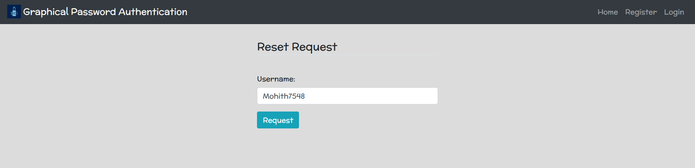
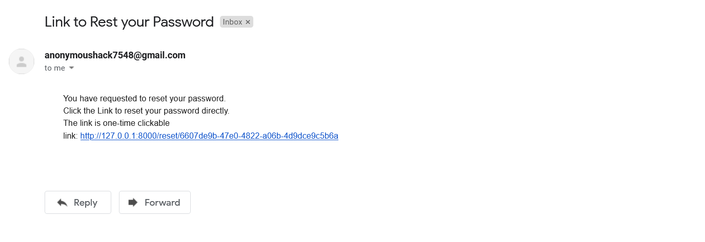
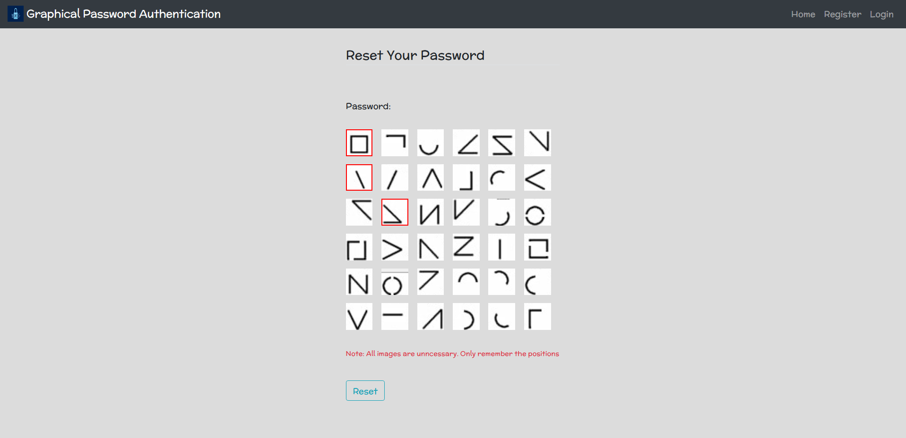
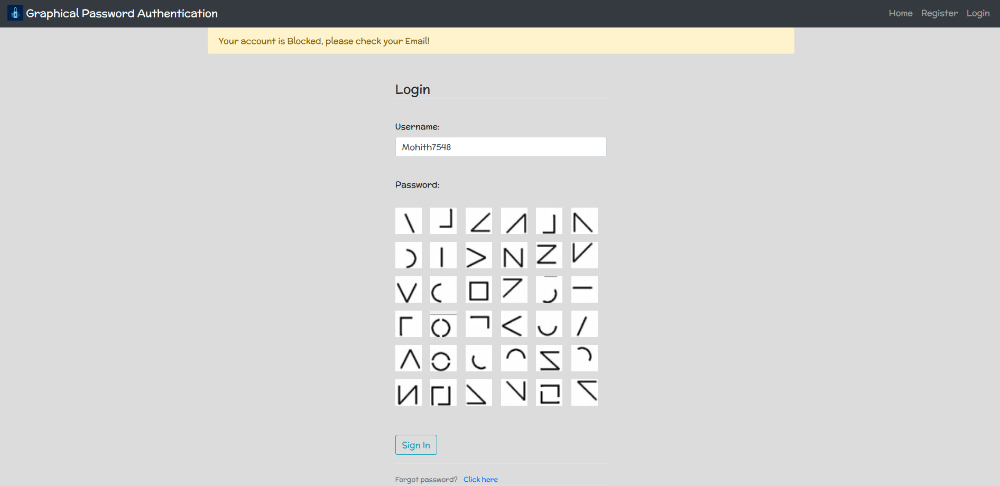
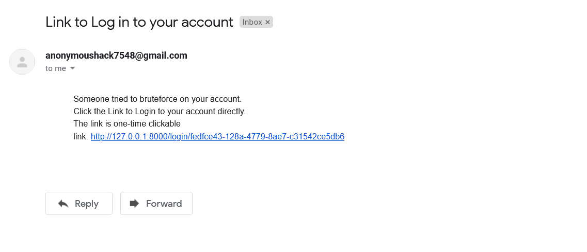

# Graphical Password Authentincation
## Inspiration:
The inspiration behind the development of a Graphical Password Authentication system is to provide an alternative method of authentication that is more secure than traditional text-based passwords, which are vulnerable to social engineering attacks.

## What does it do:
The system uses graphical images in place of regular passwords for authentication. It is resistant to popular attacks such as brute force, shoulder surfing, spyware, hidden camera, and phishing.

## Challenges we faced:
One of the major challenges was to design a system that was both secure and user-friendly. We also had to address the issue of potential attacks from adversaries who might attempt to steal the user's graphical password.

## How we built it:
We built the system using Django, Bootstrap, HTML5, CSS3, and JavaScript. We also used the Courier API to manage notifications. The system uses a combination of face recognition and mouse events to authenticate the user.

## Features:
Some of the features of the system include a hidden pattern on the screen, a camera to detect the user's face during authentication, and the ability to send notifications to the user if there are multiple failed attempts to log in.

## Tech stack:
The technology stack used in building the Graphical Password Authentication system includes Django, Bootstrap, HTML5, CSS3, JavaScript, and the Courier API.

## Future goals:
Some future goals for the system include improving the security and user-friendliness of the system, and developing new techniques to make the system even more secure against potential attacks.

## Screenshots
Welcome Page

   
Sign Up Page

 

 
After logging in

   
Password Reset Page

 

 
Mail received with password reset link

 

   
Account blocked due to multiple Failed attempts

  Notification mail received of Account blockage

 

#### Thank you

[MIT](https://choosealicense.com/licenses/mit/)

